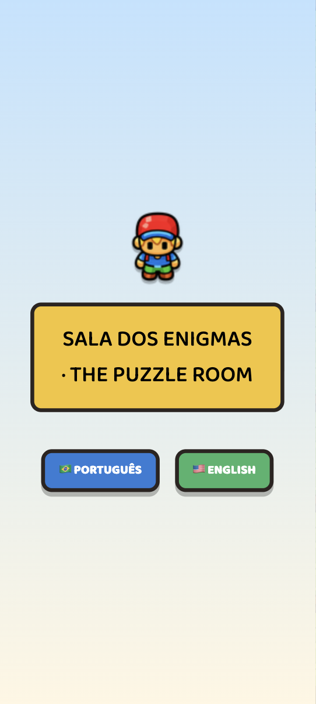
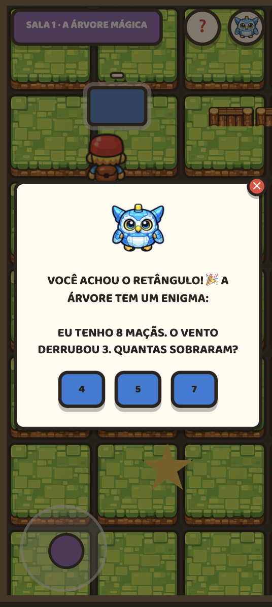
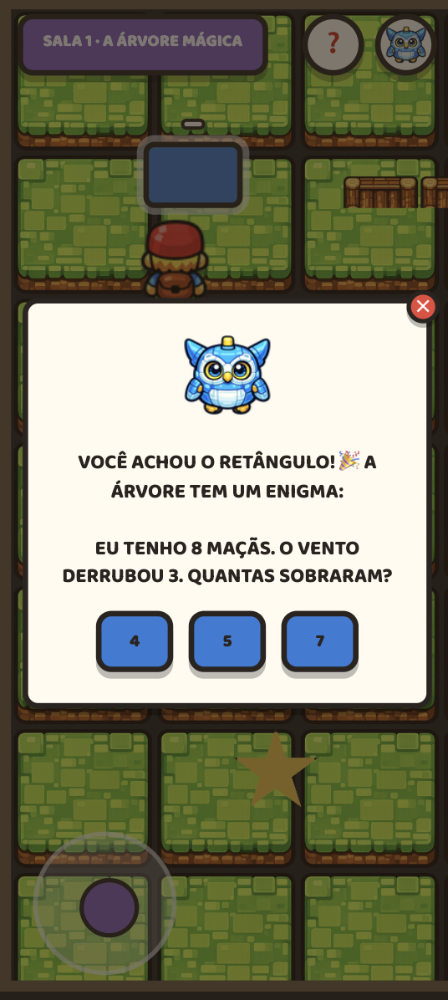

# Enigma Kids — The Puzzle Room

A 2D educational game for children that runs entirely in the browser.
No installation, no server, no dependencies — just open the HTML file.

## Screenshots

<p align="center">
  
  
  
</p>

## How to play

1. Open `index.html` in any modern browser
2. Choose your language (Português or English)
3. Use the **arrow keys** (desktop) or the **on-screen joystick** (phone/tablet)
4. Walk up to objects to interact and solve the puzzles

## What children learn

| Room | Theme | Skills |
|---|---|---|
| 1 — The Magic Tree | Geometric shapes | Identify a rectangle, simple subtraction (8−3) |
| 2 — The Inventor's Lab | Technology & safety | Hexagon, basic English vocabulary (A1 level), online safety (strangers) |
| 3 — The Dragon's Tower | Reasoning & empathy | Multiplication (3×4), English anagram (A1 words), AI draw puzzle, teamwork |

## AI — Draw Puzzle (Room 3)

Room 3 includes a free-draw puzzle powered by **TensorFlow.js** and a model trained with **Google Teachable Machine**. The child draws a shape on a canvas and a locally-running neural network classifies it in real time — no data is ever sent to a server.

### How it works

- Library: [`@teachablemachine/image`](https://teachablemachine.withgoogle.com/) (wraps TensorFlow.js)
- Model: MobileNet-based image classifier, trained on 5 shape classes
- Classes: `circle`, `triangle`, `square`, `star`, `hexagon`
- Input: 96×96 grayscale canvas snapshot
- Inference: runs fully in the browser (WebGL backend)

### Graceful fallback

If the model files are missing or fail to load, the puzzle automatically falls back to a numbered connect-the-dots mode — the game never breaks.

### Retraining the model

1. Go to [teachablemachine.withgoogle.com](https://teachablemachine.withgoogle.com/)
2. **Get Started → Image Project → Standard image model**
3. Create classes named exactly: `circle`, `triangle`, `square`, `star`, `hexagon`
4. Draw ~50 examples per class (vary size, angle, stroke thickness)
5. Click **Train Model**, then **Export Model → TensorFlow.js → Download**
6. Extract the `.zip` and replace the files in `model/`

See [`model/README.md`](model/README.md) for full instructions and tips.

### Adding new shapes

1. Add the new class in Teachable Machine, retrain, and re-export
2. Add the class name (lowercase string) to `AI_SHAPE_CLASSES` in [`src/game/ai-puzzle.js`](src/game/ai-puzzle.js)
3. Add PT/EN labels to `SHAPE_LABELS` and the SVG example to `SHAPE_EXAMPLE_SVG` in the same file
4. Add dot-guide points to `SHAPE_DOT_POINTS` (used by connect-dots hint mode)
5. Add the mapping in `_SHAPE_NAME_TO_CLASS` in [`src/game/rooms/room3.js`](src/game/rooms/room3.js)

## Stack

- HTML5 + CSS3 + JavaScript ES6+ (no framework, no build step)
- HTML5 Canvas API for drawing puzzles
- Touch Events API for mobile joystick
- TensorFlow.js + `@teachablemachine/image` for AI shape recognition (Room 3)
- Images embedded as base64 (works offline)
- Google Fonts — Baloo 2

Full details in [.agents/rules/stack.md](.agents/rules/stack.md).

## Project structure

```
Enigma Kids/
├── index.html              — primary deliverable (complete game)
├── model/                  — TensorFlow.js model (Teachable Machine export)
│   ├── model.json          — model architecture + weights index
│   ├── weights.bin         — trained weights (~1.7 MB)
│   ├── metadata.json       — class names and Teachable Machine metadata
│   └── README.md           — retraining instructions
├── imagens/                — sprite source files (PNG)
├── assets/                 — separate exports for future use
├── src/
│   ├── game/
│   │   ├── ai-puzzle.js    — TensorFlow.js integration, draw canvas, fallback
│   │   ├── engine.js       — game loop, camera, collision
│   │   ├── main.js         — entry point
│   │   ├── ui.js           — modal, HUD helpers
│   │   ├── randomizer.js   — puzzle bank randomization
│   │   ├── assets.js       — base64 image registry
│   │   └── rooms/          — per-room logic (room1.js, room2.js, room3.js)
│   ├── i18n/strings.js     — all PT/EN game text
│   └── styles/main.css     — design tokens and components
└── .agents/rules/          — project rules and architecture decisions
```

## Security

The game **makes no network calls** at runtime beyond Google Fonts and loading the local model files from `model/`.
No user data is collected or sent anywhere. The AI model runs entirely client-side.

If AI features are extended in the future (e.g. a remote model, adaptive content), refer to [.agents/rules/security.md](.agents/rules/security.md) for guidelines on prompt injection, API keys, and LGPD.

## Characters

- **Protagonist**: playable character controlled by the child
- **LUMI**: mascot that appears with hints when the child asks for help
- **Mysterious Shadow**: Room 2 character that teaches online safety
- **Librarian Dragon**: guardian of Room 3

## Design decisions

**Single file**: simplifies distribution in educational settings — teachers send the file, children open it in the browser.

**No persistence**: no login, no cookies, no localStorage. Each session starts fresh, with no personal data.

**Bilingual**: PT-BR and EN-US selectable on the start screen, with all content duplicated in the `STR` object.

**AI model versioned in the repo**: the model is ~1.7 MB total and is required for the game to work offline. It is committed alongside the code. If the model grows significantly, consider hosting it externally and updating `AI_MODEL_PATH` in `ai-puzzle.js`.
